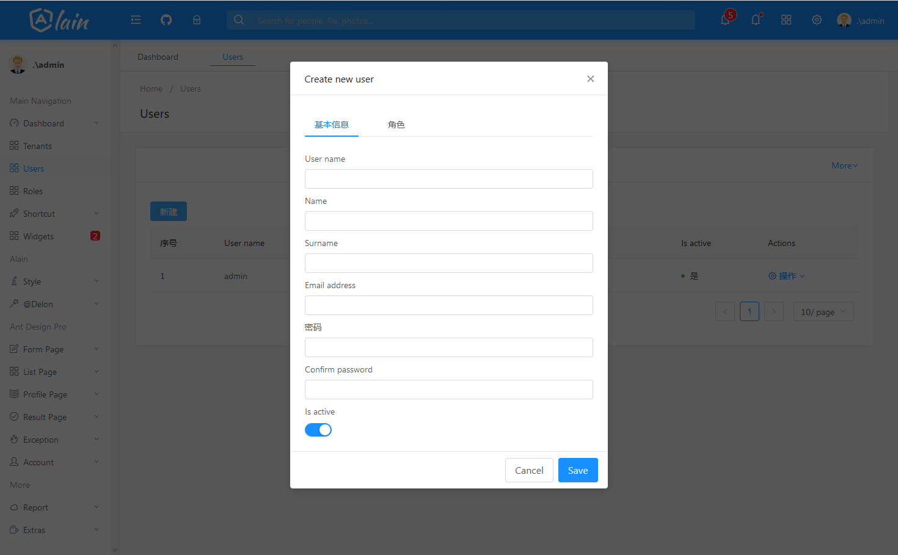

# 介绍

Abp 结合前端 ng-alain的项目

Abp 使用的3.8.0

[ABP & NG-ALAIN](https://www.jianshu.com/p/589af988637c)

#  进展

- [x] abp前端类库引入
  - [x] abp 初始化
  - [x] abp message
  - [x] abp notiy
- [x] 登录页改造
  - [x] 语言切换
  - [x] 租户切换
  - [x] 登录
  - [x] 登陆守护
- [x] 菜单改造
  - [x] 菜单配置
  - [x] 菜单权限
  - [x] 左侧面板用户信息
- [x] header布局改造
  - [x] 多语言
  - [x] 用户信息显示
- [x] 租户管理
  - [x] 列表
  - [x] 新增
  - [x] 编辑
  - [x] 删除
- [x] 用户管理
  - [x] 列表
  - [x] 新增
  - [x] 编辑
  - [x] 删除
- [x] 角色管理
  - [x] 列表
  - [x] 新增
  - [x] 编辑
  - [x] 删除
  

# 页面展示

#### 首页面板

#### 创建用户弹出框

#### 登陆页

#### 我的公众号

# 文档

* [ASP.NET Core MVC & jQuery version.](https://aspnetboilerplate.com/Pages/Documents/Zero/Startup-Template-Core)
* [ASP.NET Core & Angular  version.](https://aspnetboilerplate.com/Pages/Documents/Zero/Startup-Template-Angular)
* [ng-alain.](https://ng-alain.com/)

# License

[MIT](LICENSE).