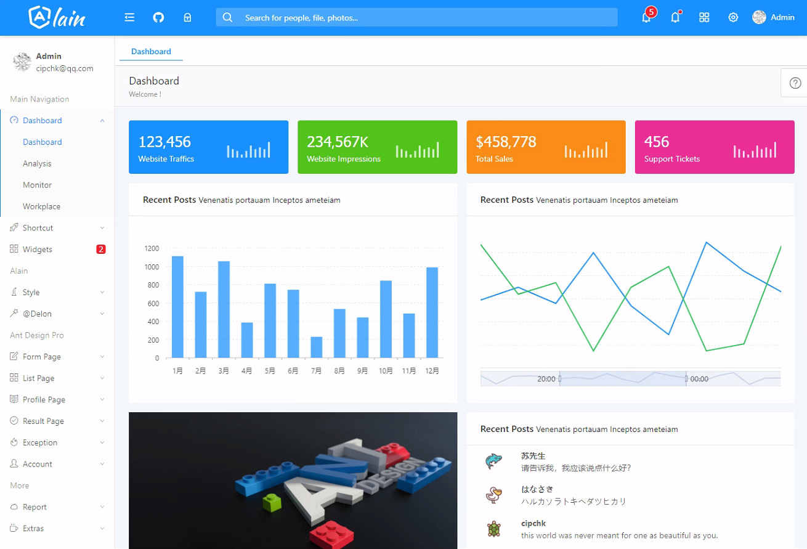
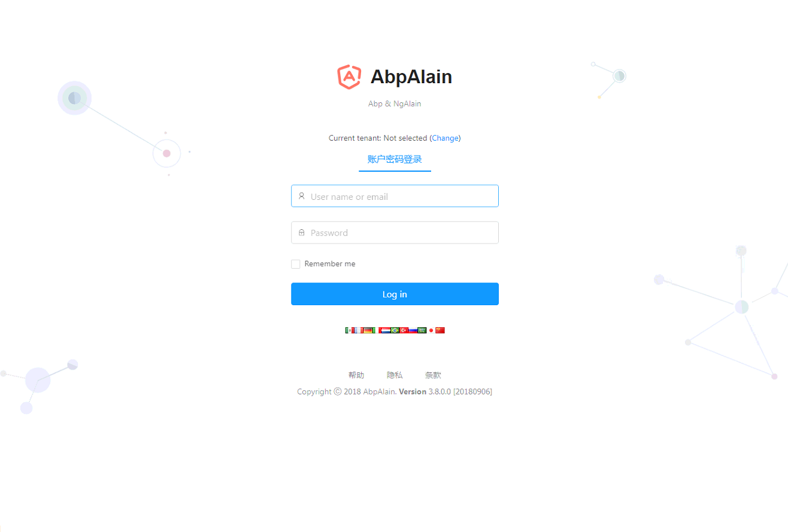

# 介绍

Abp 结合前端 ng-alain的项目

Abp 使用的3.8.0

#  进展

- [x] abp前端类库引入
  - [x] abp 初始化
  - [x] abp message
  - [x] abp notiy
- [x] 登录页改造
  - [x] 语言切换
  - [x] 租户切换
  - [x] 登录
  - [x] 登陆守护
- [ ] 菜单改造
  - [ ] 菜单配置
  - [ ] 菜单权限
- [ ] header布局改造
  - [ ] 多语言
  - [ ] 用户信息显示
  

# Screenshots

#### 首页面板

#### User Creation Modal

#### 登陆页

#### 我的公众号

# Documentation

* [ASP.NET Core MVC & jQuery version.](https://aspnetboilerplate.com/Pages/Documents/Zero/Startup-Template-Core)
* [ASP.NET Core & Angular  version.](https://aspnetboilerplate.com/Pages/Documents/Zero/Startup-Template-Angular)

# License

[MIT](LICENSE).